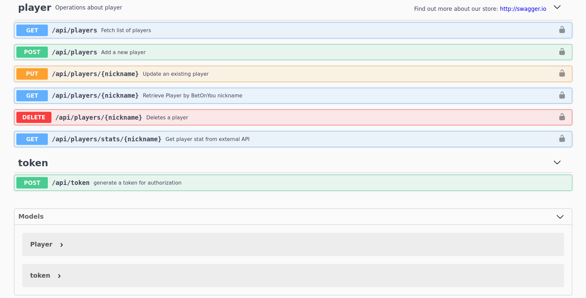
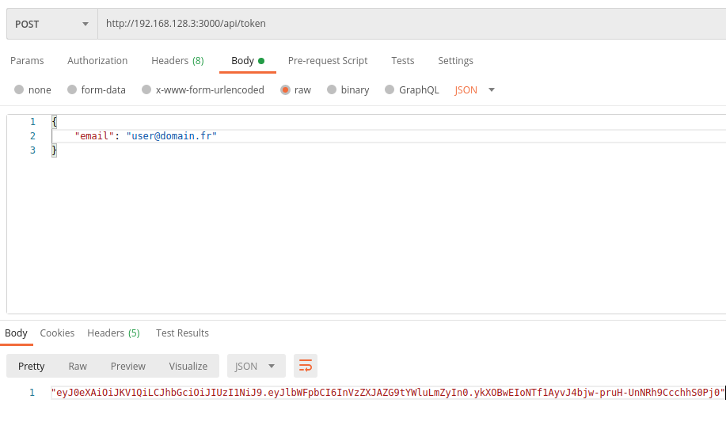
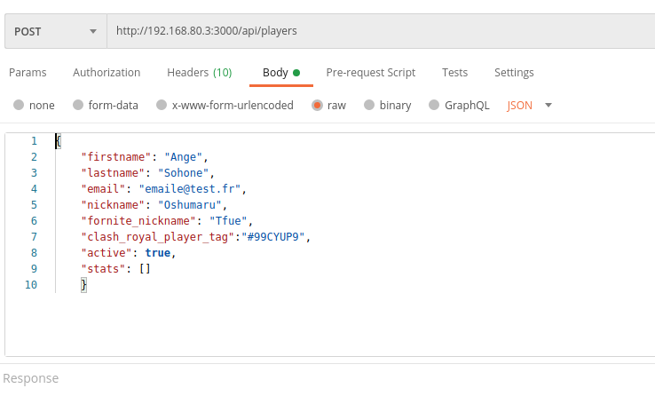
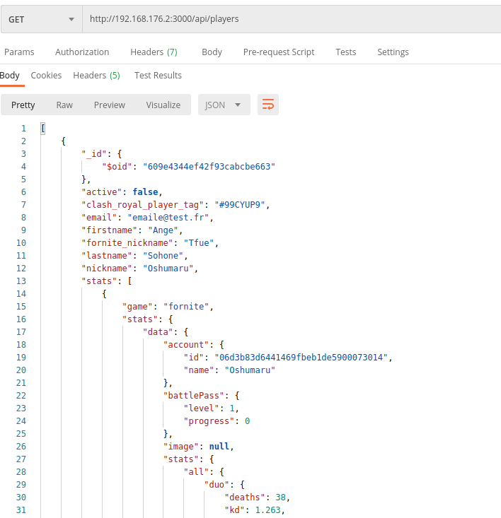

# Docker Flask 

Service built in top of [Docker Compose](https://docs.docker.com/compose/) template for orchestrating a [Flask](http://flask.pocoo.org/) application & a 

### Installation

```bash
git clone https://github.com/angegnango/players-stats-tdd
```

### Build & Launch

```bash
docker-compose up
```

This will expose the Flask application's endpoints on port `http://YourIp:3000` 

get the IP from docker console


### Endpoints
---



### How to use
---

Get a token


Add a player


Get player stat



To shut down:

```bash
docker-compose down
```


---